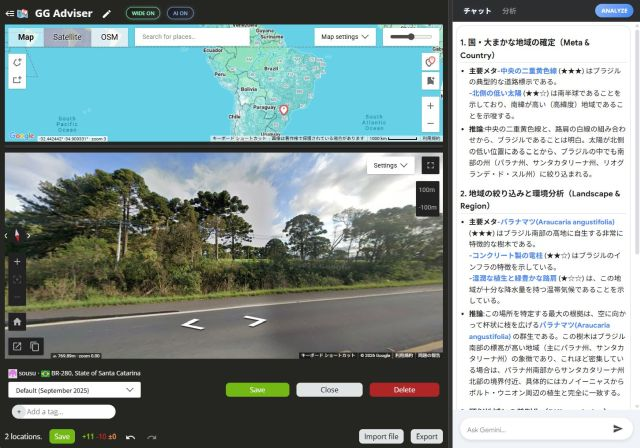
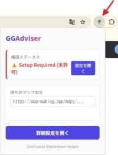
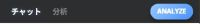
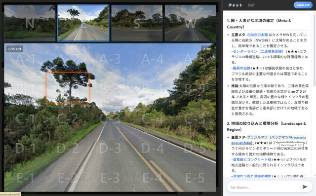

# GGAdviser (v1.0.5)

Geoguessrのプレイ結果を `map-making.app` と `Gemini` を使って効率的に振り返るためのChrome拡張機能です。

---

## ✨ 主な機能

### 1. ワンクリックで「分析環境」を即座に構築
Geoguessrの結果画面で **[MAP MARKING APP]** ボタンを押すだけで、正解地点へのジャンプ、AI への接続を瞬時に完了します。
面倒な座標のコピペは不要。**あとは AI に質問するだけの状態** まで、全てをセットアップします。

### 2. 「ストリートビュー + 地図 + AI解説」を1画面に集約
`map-making.app` の地図、大きなストリートビュー、そして Gemini による分析結果を同時に並べて表示します。
ストリートビューを広々と表示しながら AI の解説を読み解ける専用レイアウトにより、複数のタブを切り替える手間なく、情報を一目で照らし合わせることが可能です。

### 3. 表示モードの柔軟な切り替え
ヘッダーのボタン（AI ON/OFF, WIDE ON/OFF）により、AIパネルの表示・非表示や、分析に最適なワイドモード（地図 + ストリートビューの並立）を即座に切り替えられます。

---

## 🚀 導入と設定

### 1. インストール
1. このリポジトリをダウンロード（ZIP）し、解凍します。
2. Chrome ブラウザで `chrome://extensions/` を開きます。
3. 右上の「デベロッパーモード」を **ON** にします。
4. **「パッケージ化されていない拡張機能読み込む」** で解凍したフォルダを選択します。

### 2. 初期設定（Popup Dashboard）
拡張機能のアイコンをクリックすると、**設定ダッシュボード（ポップアップ）** が開きます。ここで初期設定を完了させてください。

1.  **【重要】権限ステータスの確認**:
    - 上部に「⚠️ Setup Required」と表示されている場合は、**「設定を開く」** ボタンを押し、詳細設定画面でキャプチャ権限を許可してください。
    - ※ これを行わないと、分析機能が動作しません。
2.  **Result Map URL の設定**: 
    - 自分が作成した `map-making.app` のマップURL（例: `https://map-making.app/maps/123456`）を下のフォームに入力し、保存してください。

---

## 💡 使い方とカスタマイズ

### A. 分析を開始する（Geoguessr の終了画面から）
1. ゲーム終了後のリザルト画面（Breakdown）で、追加された **[MAP MARKING APP]** ボタンをクリックします。
2. 自動的に `map-making.app` が開き、その地点の正解座標にジャンプします。
3. 右側パネル上部の **[ANALYZE]** ボタンを押すと、Gemini が開き、画像とプロンプトが自動入力されます。

4. 内容を確認し、Gemini 側の **送信ボタン（紙飛行機アイコン）** をクリックしてください。
5. 分析が完了すると、自動的に元のマップ画面に戻り、結果が表示されます。

### B. Map Editor 上で表示を切り替える
ヘッダーに追加されたボタンで、分析画面のレイアウトを調整できます。
- **[AI ON/OFF]**: 右側の AI パネルを出したり隠したりします。
- **[WIDE ON/OFF]**: 地図パネルを隠し、ストリートビューと AI 解説を横いっぱいに広げます。

### C. 分析結果をつかって振り返る (Interactive Analysis)
AI が生成した解説内のリンクをクリックすると、以下のインタラクティブな機能が作動します。

- **証拠画像オーバーレイ**: 解説文中の「手がかり」をクリックすると、AI が注目したストリートビュー上の該当箇所がハイライトされます。
- **双方向ハイライト**: 逆に、ストリートビュー上のグリッドにマウスを乗せると、それに対応する解説文がハイライトされます。

### D. AIプロンプトの書き換え（自分専用のAIにする）
オプション画面の **Prompt Template** を書き換えることで、AIの回答を自由に調整できます。

- `{{lat}}`, `{{lng}}`, `{{date}}` といった変数を使用すると、解析時に実際の地点データに自動置換されます。
- 「電柱の形を詳しく教えて」「看板の言語から国を判定して」など、指示を具体的にするほど分析の精度が向上します。
- 「プロンプトを初期化」ボタンで、いつでも推奨の標準テンプレートに戻せます。

---

## 🔐 プライバシーと権限について
- 設定したURLやプロンプトはブラウザ（`chrome.storage.local`）にのみ保存され、外部に送信されることはありません。
- **画面キャプチャ権限 (`<all_urls>`) について**:
    - v1.0.3 より、インストール時の必須権限ではなく **「オプション権限（あとから許可）」** に変更しました。
    - 分析機能を利用するためには、設定画面で **明示的に許可** していただく必要があります。
    - これは、ユーザーの意図しない広範な権限付与を防ぐための措置です。技術的には、ページ内に埋め込まれたスクリプトからスクリーンショットを撮るために使用されますが、実際のデータ取得は `map-making.app` 上でのみ実行されます。
- その他、機能の実現に必要な最小限の権限（タブの読み取り、ストレージ）のみを使用しています。

---

